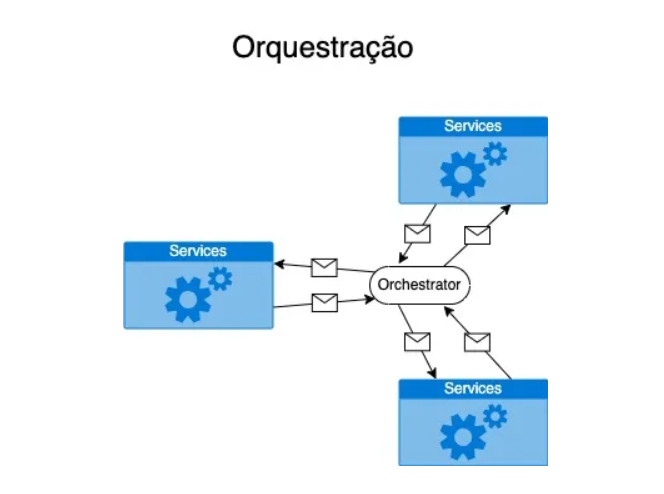

# Orquestração

A orquestração em sistemas distribuídos é uma abordagem onde um componente centralizado — o orquestrador — coordena as interações entre serviços. Esse orquestrador controla o fluxo de atividades, definindo a ordem em que cada serviço deve ser acionado e acompanhando o progresso de todo o processo. Com isso, a orquestração oferece uma visão centralizada e facilita o controle sobre as operações.

Como Funciona a Orquestração em Ambientes Distribuídos
Na prática, orquestração significa definir um fluxo centralizado que especifica a sequência das tarefas que os serviços devem executar. Cada serviço é acionado de acordo com as instruções do orquestrador, que determina não apenas quais ações devem ser realizadas, mas também em que momento cada serviço entra em ação, criando um sistema de coordenação organizado e centralizado.

Exemplo de Orquestração em um Sistema de E-commerce
Em um sistema de comércio eletrônico, o orquestrador pode gerir todo o fluxo de compra: ele solicita ao serviço de pagamento que processe o pagamento e, após a confirmação, aciona o serviço de envio para iniciar a entrega do produto. Essa abordagem permite que o orquestrador tenha controle sobre cada etapa e garanta que o processo ocorra na sequência correta.

 

Vantagens e Desvantagens da Orquestração
Vantagens:

Visibilidade e controle: Oferece uma visão clara de todo o fluxo de trabalho.
Gestão simplificada de processos complexos: É mais fácil monitorar e ajustar processos complexos centralmente.
Controle centralizado: Todas as atividades são coordenadas pelo orquestrador, tornando a gestão de mudanças mais eficiente.

Desvantagens:

Maior acoplamento: Os serviços ficam mais dependentes do orquestrador.
Menor flexibilidade para escalabilidade horizontal: O orquestrador centralizado pode limitar a escalabilidade.
Ponto único de falha: Se o orquestrador falha, o sistema perde sua capacidade de coordenação.