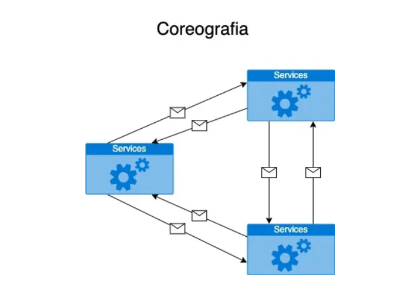

# Coreografia

## Coreografia: Coordenação Descentralizada entre Serviços

Quando analisamos a comunicação entre microsserviços em uma rede, a estrutura pode parecer caótica, e esse caos pode levar a desafios significativos de gerenciamento, monitoramento e até de custo com chamadas de rede. É aqui que entra um dos principais riscos desse modelo: o fenômeno da “Death Star” ou “Estrela da Morte”. Esse termo se refere ao emaranhado de conexões e interações entre microsserviços, tornando o ambiente extremamente complexo. Em arquiteturas massivas, como as da Netflix ou da Amazon, vemos milhares de microsserviços interligados, o que exige uma estrutura robusta e uma equipe altamente qualificada para gerenciar toda essa complexidade. No entanto, para empresas menores, que não possuem os mesmos recursos financeiros e técnicos, esse tipo de complexidade pode se tornar um gargalo.

O que é Coreografia em Sistemas Distribuídos?

Coreografia é uma abordagem em que os serviços interagem diretamente, sem um ponto central de controle. Cada serviço entende e responde aos eventos ou mensagens gerados por outros serviços, formando uma rede de interações que não depende de um coordenador central. Com isso, cada serviço se torna autônomo, definindo sua lógica de integração com base em eventos claros e pré-definidos.

Vamos falar sobre o conceito de coreografia de microsserviços, um padrão amplamente utilizado em arquiteturas de microsserviços. Em essência, a coreografia permite que microsserviços se comuniquem livremente entre si, sem uma camada central de orquestração que defina a sequência exata das operações. Isso significa que, por exemplo, o microsserviço A pode chamar o B, que, por sua vez, aciona o C, e assim sucessivamente. Essa comunicação direta entre serviços promove independência, mas também gera uma interdependência, criando redes complexas de chamadas entre eles.

A complexidade excessiva, especialmente quando desnecessária, geralmente indica uma decisão de arquitetura equivocada. Um sistema simplificado e mais fácil de gerenciar tende a ser a melhor escolha para empresas menores ou equipes com recursos limitados. Então, antes de seguir por esse caminho, é fundamental avaliar se a sua equipe e sua empresa têm a maturidade técnica e a infraestrutura necessárias para lidar com um ambiente que pode rapidamente se tornar um labirinto de dependências e chamadas de rede.

Essa coordenação é essencial para o bom desempenho e a escalabilidade dos sistemas distribuídos, e garantir que os serviços trabalhem de forma harmônica é um ponto crucial para a confiabilidade do sistema. Duas abordagens comuns para essa coordenação são a coreografia e a orquestração. Essas abordagens não são apenas técnicas, mas representam filosofias sobre como os serviços interagem. A coreografia promove uma comunicação descentralizada entre serviços, enquanto a orquestração utiliza um controlador central para coordenar as operações.

Exemplo Prático: Coreografia em um Sistema de E-commerce
Imagine um sistema de comércio eletrônico onde serviços como pagamento, inventário e envio precisam trabalhar em conjunto para completar uma transação. Em uma arquitetura coreografada, o serviço de pagamento pode gerar um evento ao concluir a aprovação do pagamento, e o serviço de envio responde a esse evento para iniciar o despacho do pedido. Cada serviço age conforme a lógica do evento, sem precisar de uma supervisão central.

 

## Vantagens e Desvantagens da Coreografia

Vantagens:

Menor acoplamento: Os serviços podem evoluir de forma mais independente.
Escalabilidade: Cada serviço pode ser escalado de maneira autônoma.
Tolerância a falhas: A ausência de um ponto central reduz o risco de falhas sistêmicas.
Desvantagens:

Visibilidade do fluxo: É mais difícil ter uma visão geral dos processos do sistema.
Gestão complexa: À medida que o número de interações aumenta, a gestão dos serviços e de seus contratos de comunicação se torna mais complexa.