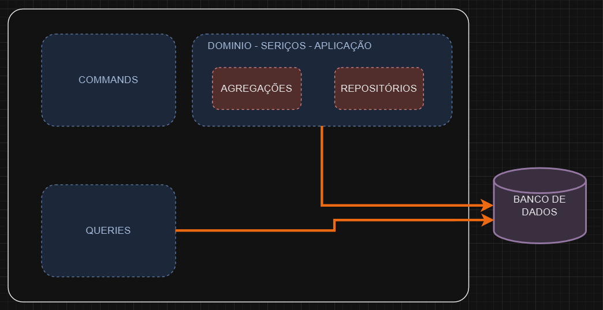
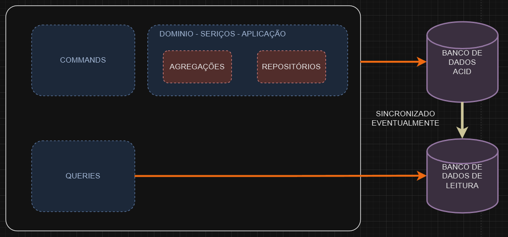

# CQRS


## Introdução

Para trabalhar com microsserviços, entender o padrão CQRS (Command Query Responsibility Segregation) é essencial, especialmente se o objetivo é escalabilidade e flexibilidade na arquitetura. Esse padrão surge da separação de responsabilidades em comandos e consultas, garantindo que operações que modificam o estado do sistema sejam tratadas separadamente das operações que apenas leem dados. Esse tipo de abordagem, embora mais complexo, proporciona uma arquitetura mais otimizada e capaz de lidar com altas demandas de leitura e escrita.

## Conceitos Básicos

Antes de falarmos sobre CQRS, vale destacar o conceito de CQS (Command Query Separation), criado por Bertrand Meyer. Em sua essência, o CQS determina que cada método deve ter uma única responsabilidade: ou ele realiza uma operação (um comando) ou retorna dados (uma consulta). Isso ajuda a evitar que um único método realize operações complexas que envolvem tanto manipulação quanto retorno de dados, o que simplifica o entendimento e a manutenção do código.

Com a evolução desse conceito, Greg Young introduziu o CQRS, que vai além da separação de métodos e passa a segmentar a própria arquitetura do sistema. No CQRS, comandos e consultas estão completamente separados, cada um representando uma responsabilidade: comandos para processar ações e consultas para recuperar dados. Isso permite, por exemplo, que operações como criação de clientes ou processamento de pagamentos sejam tratadas como intenções do usuário, separadas das leituras que exibem esses dados.

## Banco de Dados

Uma característica importante do CQRS é a flexibilidade no uso de bancos de dados. Em muitos casos, as operações de leitura e escrita ocorrem em bancos de dados distintos para otimizar o desempenho. Em uma estrutura com um único banco, as operações de leitura e escrita competem pelos mesmos recursos, o que pode reduzir o desempenho. A separação permite que bancos específicos para consultas sejam otimizados para leitura e bancos de comandos para gravação, melhorando a velocidade e a confiabilidade do sistema.

Além disso, a divisão entre bancos de dados facilita a organização dos dados em formatos apropriados para leitura e escrita. Por exemplo, dados complexos e altamente estruturados podem ser armazenados em um banco de dados relacional, enquanto dados para consultas rápidas podem ser replicados e formatados de forma otimizada para leitura em outro banco. Essa abordagem, embora introduza complexidade, permite maior controle e melhor performance.

## Exemplo de Comando

Vamos considerar um comando para simular o cálculo de juros de um financiamento. O usuário envia os valores para calcular os juros e, ao processar o comando, o sistema aplica regras de negócio e grava as parcelas no banco de dados. Observe que o comando apenas processa e grava as informações, sem retornar nenhum dado diretamente ao usuário final. Se houver um erro, um evento é gerado para tratamento; caso contrário, o sistema registra as parcelas e conclui a operação. Essa divisão permite que o coração do sistema, onde as regras de negócios residem, seja robusto e focado em operações complexas.

```csharp
public class CalcularJurosCommand 
{
    public decimal Valor { get; set; }
    public int Parcelas { get; set; }

    public void Execute() 
    {
        // Processa regras de negócio
        List<Parcela> parcelas = CalcularParcelas(Valor, Parcelas);
        RepositorioParcelas.Salvar(parcelas);
        // Não retorna dados ao usuário final
    }
}
```

## Exemplo de Consulta
Agora, imagine que o usuário queira consultar as parcelas de juros de seu financiamento. Esse pedido aciona uma query, uma operação exclusivamente de leitura que extrai os dados do banco de consultas e os apresenta de forma otimizada. Diferente dos comandos, as consultas são rápidas e diretas, focando apenas em fornecer os dados necessários, sem regras de negócio adicionais.

```csharp
public class ConsultaParcelasQuery 
{
    public int FinanciamentoId { get; set; }

    public List<Parcela> Execute() 
    {
        // Consulta simples ao banco de dados, sem processamento adicional
        return RepositorioParcelas.ObterPorFinanciamento(FinanciamentoId);
    }
}
```

## Mecanismos de Sincronização e Consistência

Para sincronizar dados entre bancos de comandos e consultas, é possível utilizar mecanismos como Dual Writes, Change Data Capture (CDC), Message Queues ou Pub/Sub Systems. Cada um desses mecanismos oferece vantagens e desvantagens dependendo das necessidades de consistência do sistema. Por exemplo, o CDC captura alterações em tempo real, enquanto Dual Writes grava os dados em ambos os bancos ao mesmo tempo. É importante considerar que essa abordagem pode introduzir alguma inconsistência temporária nos dados, que, embora seja insignificante em muitas aplicações, precisa ser avaliada conforme o impacto no sistema.

 
 

Essa é a essência do CQRS e sua aplicação no trabalho com microsserviços: uma abordagem que separa claramente comandos e consultas, facilitando tanto a escalabilidade quanto a gestão da complexidade no sistema.