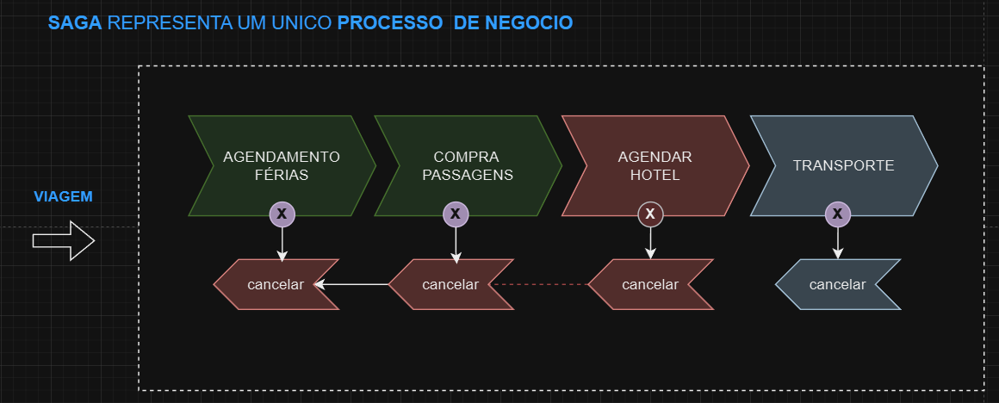

# SAGA

Para finalizarmos, vamos aprofundar o entendimento sobre o padrão Saga em microsserviços. Esse padrão é essencial porque reúne diversos conceitos importantes no contexto de sistemas distribuídos: a comunicação assíncrona, a coordenação entre serviços e, muitas vezes, o uso de um orquestrador para gerenciar essas interações.

Em um cenário de microsserviços, ou qualquer sistema distribuído, enfrentamos o desafio de coordenar uma sequência de etapas, que têm início, meio e fim, de maneira eficiente. Esse processo é complexo, tanto pelas dependências de regras de negócio quanto pelas etapas que precisam ser seguidas. Como as operações do negócio podem mudar frequentemente, o sistema precisa ser coeso e, ao mesmo tempo, flexível. O Saga entra justamente para coordenar essas etapas, garantindo a ordem e executando as compensações, ou “rollback”, caso algo dê errado. Esse tipo de fluxo é muito comum em operações que envolvem várias interdependências.

O exemplo de e-commerce ajuda a ilustrar: um cliente faz um pedido, o pagamento é processado, o produto sai do estoque, a nota fiscal é emitida, e, finalmente, o produto vai para entrega. Se houver um problema na entrega, precisamos cancelar a nota, devolver o produto ao estoque e estornar o pagamento. O orquestrador do Saga garante que essas etapas sejam seguidas, tanto em situações de sucesso quanto em cenários de falha que exigem compensações.
Com o padrão Saga, podemos orquestrar todas essas ações para que, se algo falhar, as etapas possam ser revertidas de forma ordenada, garantindo que cada serviço envolvido execute sua compensação.

Em sistemas distribuídos modernos, cada etapa costuma rodar em microsserviços independentes e, muitas vezes, de forma assíncrona para aumentar a resiliência do sistema. Em vez de depender de chamadas REST síncronas, muitas operações são colocadas em filas ou tópicos para processamento, e os serviços envolvidos respondem conforme terminam suas tarefas. No próximo vídeo, exploraremos um fluxo de Saga que criei, e veremos como isso pode ser aplicado no código.

 