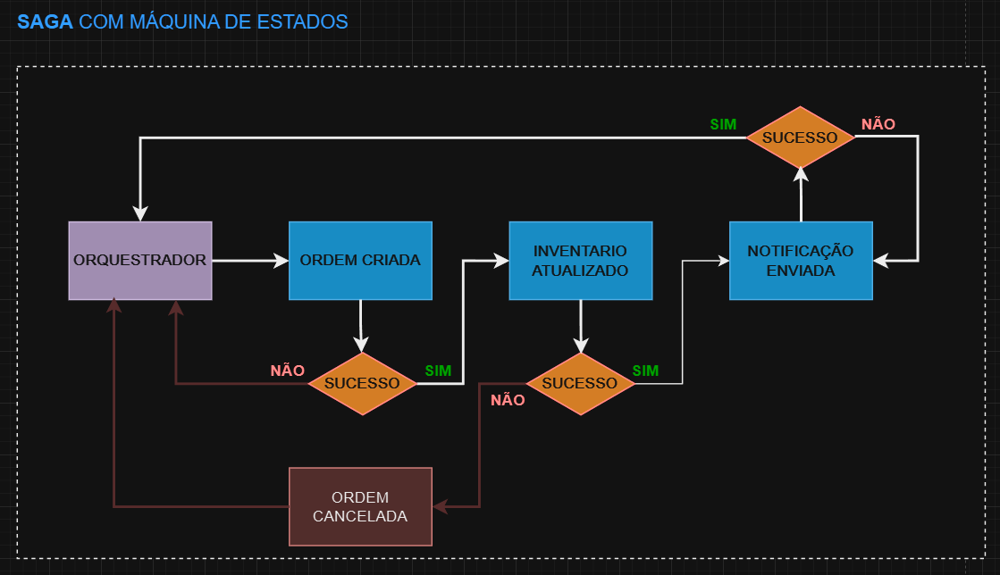

# Compensação

Ao utilizar o padrão SAGA com um orquestrador, temos um serviço central que gerencia toda a lógica de execução dos passos da transação. Esse orquestrador atua enviando e recebendo informações entre os microsserviços, geralmente usando eventos que trafegam por tópicos de mensagens. É importante destacar que, embora frequentemente associada a filas, a SAGA pode funcionar com outros meios de comunicação, como chamadas REST.

Porém, ao utilizar REST, surge uma questão de disponibilidade. Se, por exemplo, ao enviar uma requisição para o serviço 3, ele estiver indisponível, será necessário implementar um mecanismo de re-tentativas, com estratégias como o backoff exponencial. Esse mecanismo tenta a reconexão em intervalos cada vez maiores — 2, 4, 8 segundos, e assim por diante — aumentando o intervalo até que o serviço retorne ou o processo seja abandonado. Essa abordagem é essencial, mas adiciona uma camada de complexidade ao gerenciamento de falhas na comunicação síncrona.

Por outro lado, ao utilizar filas, obtemos maior resiliência, já que a fila retém a mensagem até que o serviço esteja disponível para processá-la. No entanto, isso não elimina totalmente a necessidade de lidar com erros. Se ocorrer uma falha durante uma operação de compensação, isso precisa ser tratado de forma especial. Nesses casos, podemos criar um tópico de erros dedicado, onde cada falha de compensação é registrada. Esse tópico pode ser monitorado por um sistema automatizado que retente a operação ou por um operador que faça uma revisão manual dos casos e acione uma nova tentativa após entender a causa.

Esse modelo de controle de erros é essencial para garantir que todas as transações sejam rastreadas e nenhum processo fique incompleto. Mesmo quando se trabalha com comunicação assíncrona via filas, a análise e resolução de erros são indispensáveis.

A comunicação síncrona (como REST, gRPC ou GraphQL) ainda está sujeita a interrupções de rede e momentos de indisponibilidade durante atualizações, por exemplo, onde o retry é obrigatório. Já a comunicação por filas mitiga parte desses problemas, mas exige uma arquitetura específica para lidar com as tentativas de compensação. Em resumo, cada abordagem tem suas vantagens e complexidades, sendo crucial avaliar qual delas é mais adequada de acordo com o nível de resiliência e confiabilidade que o sistema exige.

 