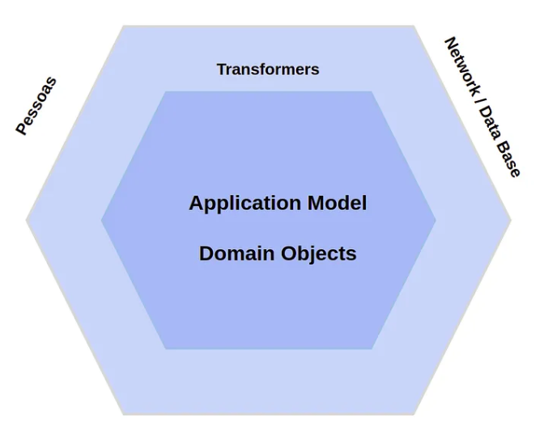
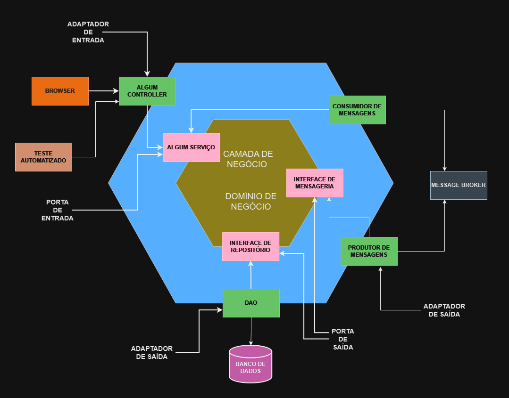

# Arquitetura Hexagonal ou Ports & Adapters?

Para entender a Arquitetura Hexagonal, é importante desmistificar alguns conceitos e termos. <a href="https://alistair.cockburn.us/coming-soon/" target="_blank">Alistair Cockburn</a>, ao criar essa <a href="https://wiki.c2.com/?HexagonalArchitecture=" target="_blank">arquitetura</a>, nomeou-a inicialmente como <a href="https://wiki.c2.com/?PortsAndAdaptersArchitecture=" target="_blank" >"Ports & Adapters Architecture"</a>. Em seu artigo, ele se refere ao hexágono, mas o conceito e a própria nomenclatura geram certa confusão.

Segundo Cockburn, ele imaginou a arquitetura em forma de um hexágono, sem uma necessidade específica para o número de lados. Somente em 2015, ele consolidou a ideia de que cada lado do hexágono representa um “Port” (Porta) e que cada um desses Ports se conecta a um “Adapter” (Adaptador). Assim, os Ports definem os pontos de comunicação para a aplicação, enquanto os Adapters são os componentes que se integram aos Ports para estabelecer conexões com sistemas externos.

Outro ponto que gera equívoco é o termo "Adapters". Aqui, ele não se refere diretamente ao Design Pattern Adapter. Na verdade, a arquitetura hexagonal é flexível quanto ao uso de padrões de design, e qualquer padrão que promova a clareza e a modularidade do sistema pode ser aplicado.

## Origem da Arquitetura Ports & Adapters

A arquitetura Ports & Adapters surgiu como uma evolução da Four Layer Architecture, que, por sua vez, aprimorava o tradicional modelo MVC. O Four Layer Architecture buscava uma separação clara em quatro camadas: View Layer, Application Model, Domain Layer e Infrastructure Layer.

No entanto, Alistair Cockburn propôs um modelo mais flexível, que dispensasse a obrigatoriedade de uma camada específica de View (interface de usuário) e da separação rígida entre Application e Domain. Para Cockburn, a arquitetura deveria ser mais adaptável, permitindo que interações fossem facilmente substituídas por outras sem impactar o design central.

Cockburn ilustra essa ideia ao sugerir que a interface de usuário poderia ser trocada por um grande arquivo de casos de testes, ou que a comunicação com o banco de dados ou redes poderia ser substituída por um banco de dados experimental local ou envio de dados via satélite. A arquitetura ideal, para ele, deveria ser indiferente a essas mudanças.

Esse conceito de simetria é central na Arquitetura Hexagonal, que visa um modelo no qual as interações ocorrem de maneira uniforme e independente de sua origem. A estrutura pode ser resumida como:

FORA <-> TRASNFORMADOR <-> (Application <-> Domain)

Nesse modelo, elementos como a interface de usuário e bancos de dados estão fora do sistema (OUTSIDE), enquanto o foco da arquitetura permanece no core do negócio. Esse foco obriga o engenheiro a refletir sobre o propósito do sistema: qual problema ele resolve e qual é sua função principal? Elementos que não respondem diretamente a essas perguntas tornam-se apenas formas de entrada e saída de dados.

O objetivo da Arquitetura é possibilitar que eventos externos (OUTSIDE) sejam recebidos pelo sistema, transformados e encaminhados para a aplicação (Application Model), que então interage com o núcleo do domínio (Domain).

A arquitetura foi concebida com a ideia de hexágonos concêntricos. Cada face do hexágono mais externo representa um ponto de comunicação com o mundo exterior, os chamados Ports (Portas), enquanto as faces do hexágono mais interno representam as conexões com o domínio, chamadas de Adapters (Adaptadores), também conhecidos inicialmente como Transformers. Esses Adapters são responsáveis por traduzir as interações externas em formatos que o domínio compreenda, mantendo o foco em uma comunicação modular e independente entre a aplicação e o mundo externo.

Segue abaixo uma evolução do desenho inicial:

## E o Infrastructure Layer?

Agora que entendemos o papel dos “Ports” e “Adapters”, vamos detalhar o que é o Infrastructure Layer.

O Infrastructure Layer, de maneira resumida, é responsável por todas as classes que permitem a comunicação do sistema com o mundo externo (OUTSIDE). Ele contém as implementações necessárias para que o sistema interaja com recursos externos, incluindo funcionalidades de suporte que um “Adapter” pode precisar para inicializar e funcionar adequadamente.

Por exemplo, o Infrastructure Layer pode incluir scripts SQL para criação de banco de dados, abstrações para troca de arquivos via AWS S3, ou classes de configuração para frameworks específicos, como configurações do Spring, Swagger, ou a leitura de arquivos YAML. Esses exemplos são comuns no ecossistema Java/Kotlin, mas o conceito é adaptável a qualquer linguagem de programação: basta criar o “Adapter” correspondente.

## O que a Arquitetura Ports & Adapters Resolve?

Ao adotar a Arquitetura Ports & Adapters, ganhamos flexibilidade para integrar e substituir tecnologias de entrada e saída de dados sem impactar o núcleo do sistema, mantendo o Application e o Domain isolados. Dessa forma, qualquer nova tecnologia que precise ser usada para um propósito específico pode ser conectada ao sistema como um novo Adapter, sem afetar as regras de negócio.

Um dos maiores benefícios dessa arquitetura é a melhoria na testabilidade. Com as interações tecnológicas bem definidas por meio dos Adapters, torna-se mais simples criar testes unitários e integrados (mockados ou reais), facilitando o desenvolvimento diário.

### Desvantagens

Implementar Ports & Adapters demanda mais esforço e código, pois é necessário criar abstrações adicionais. Embora esse ponto possa ser uma desvantagem inicial, ele também ajuda na criação de testes mais eficazes.

Além disso, a flexibilidade dos Layers pode levar ao risco de Overengineering. É fácil cair na tentação de criar uma estrutura complexa com muitas abstrações e múltiplos Ports, o que pode tornar a manutenção complicada. Um sistema com muitos Ports e Adapters pode se tornar um desafio se cada funcionalidade precisar interagir com diversas abstrações.

### Tamanho do Sistema e Adaptação ao Modelo

Para sistemas maiores, o modelo de microsserviços se alinha bem com Ports & Adapters, pois o isolamento de domínios facilita a separação e a independência entre serviços.

## Guideline e Melhor Prática

A ausência de um guideline oficial torna o início um pouco difícil, pois existem várias abordagens e exemplos diferentes para implementar essa arquitetura, dependendo da linguagem e do cenário. Como orientação, pense sempre em interfaces (Ports) e nas implementações concretas (Adapters) que usam frameworks. É fundamental resolver um problema de cada vez e evitar se deixar levar por abstrações desnecessárias ou pela influência de frameworks específicos, que podem desviar o foco da arquitetura principal.