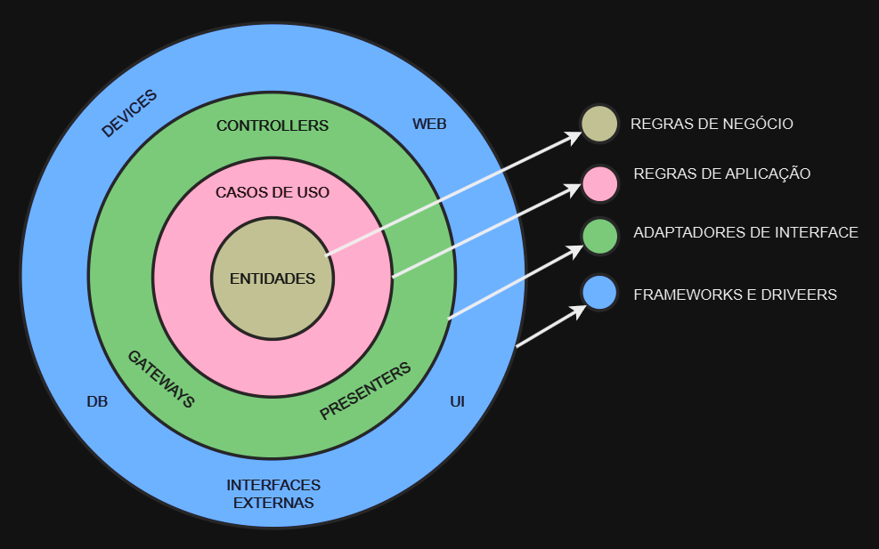

# Introdução a Arquitetura Limpa

Nos últimos anos, surgiram várias abordagens arquiteturais para sistemas, incluindo Arquitetura Hexagonal (Ports and Adapters) de Alistair Cockburn, Onion Architecture de Jeffrey Palermo, DCI de James Coplien e Trygve Reenskaug, entre outras. Embora diferentes, todas essas abordagens compartilham um objetivo comum: a separação de responsabilidades por meio de camadas de software. Cada uma dessas arquiteturas isola as regras de negócio, garantindo que a aplicação seja independente de frameworks, fácil de testar e livre de amarras com a interface do usuário, banco de dados e qualquer outra dependência externa.

## Regras de Dependências

A principal regra dessa arquitetura é a "Regra de Dependência", que estabelece que as dependências de código-fonte devem sempre apontar para o centro do sistema. Isso significa que as camadas mais internas, contendo as regras de negócio, não devem conhecer as camadas externas. Os nomes, funções, variáveis e formatos de dados das camadas externas não devem ser referenciados pelas internas, assegurando que mudanças na interface externa não impactem o núcleo do sistema.

## Entidades

As Entidades representam as regras de negócio centrais que são amplamente aplicáveis em todo o sistema, ou mesmo em vários sistemas da empresa. Elas encapsulam as regras de negócio mais fundamentais e estão na camada mais interna, garantindo que permaneçam inalteradas, independentemente de mudanças operacionais, como uma alteração na interface de navegação ou na segurança. Se você está desenvolvendo um único aplicativo, as Entidades são os objetos de negócio mais robustos e isolados de mudanças externas.

Aqui se formos fazer um comparativo superficial entre arquiteturas orientadas a domínio das demais, é como se as nossas entidades de banco tivessem as regras de negócio. Não é exatamente isso, mas para entender a camada.

## Casos de Uso

A camada de Casos de Uso contém as regras de negócio específicas do aplicativo. Esta camada orquestra a interação dos dados com as Entidades, direcionando-as a usar suas regras de negócio para alcançar os objetivos do caso de uso. Esta camada é isolada de preocupações externas como o banco de dados ou a interface, mas é afetada por mudanças nas operações da aplicação, refletindo modificações nos requisitos dos casos de uso.

Seguindo o comparativo, aqui ficam os orquestradores das regras de negócio, como nossos controllers estão para fora desta camada, dado que temos que ter independência de tecnologia em clean architecture, os nossos casos de uso fazem o que nós temos costume de fazer nos nossos controllers de apis/web em outras arquiteturas.

## Interface Adapters

A camada de Interface Adapters adapta os dados para o formato mais conveniente para uso interno, convertendo-os de um formato externo, como o do banco de dados ou de uma interface web. É nesta camada que ocorre a adaptação para o modelo MVC em uma GUI. Ela também se encarrega de converter dados da forma conveniente para as Entidades e Casos de Uso, bem como para os frameworks de persistência (ex., banco de dados SQL), isolando o núcleo do sistema dos detalhes de implementação.

## Frameworks e Drivers

A camada mais externa é composta de frameworks e ferramentas, como o banco de dados e o framework web. Essa camada contém apenas o código necessário para conectar esses elementos ao próximo nível da aplicação, mantendo-os como “detalhes” que podem ser substituídos sem grandes impactos. Essa camada é de baixo nível e está sujeita a mudanças tecnológicas que não afetam as camadas internas.

## Somente 4 Contextos?

Essas quatro camadas são um modelo básico, mas podem ser expandidas conforme a necessidade. No entanto, a "Regra de Dependência" sempre se aplica: as dependências de código sempre apontam para o centro, tornando as camadas mais internas cada vez mais abstratas, enquanto as camadas externas permanecem detalhadas e concretas.

## Cruzando Contextos

Os contextos, ou limites das camadas, são cruzados utilizando o Princípio da Inversão de Dependência. O fluxo de controle geralmente começa na camada de Interface Adapter, passa pela camada de Casos de Uso e retorna à Interface Adapter para exibir a resposta. Para cruzar os limites sem violar a "Regra de Dependência", interfaces são criadas na camada interna, implementadas por classes das camadas externas, mantendo a independência das camadas centrais.

## Quais Dados Ultrapassam os Contextos

Apenas estruturas de dados simples cruzam os limites das camadas. Essas estruturas podem ser DTOs (Data Transfer Objects) ou argumentos em chamadas de função, garantindo que as camadas internas não carreguem dependências das camadas externas. Isso previne violações da "Regra de Dependência" e preserva a independência das Entidades.

## Conclusão

Seguir essas regras arquiteturais cria um sistema testável e flexível. Ao dividir o software em camadas e aplicar a "Regra de Dependência", você facilita futuras manutenções e adaptações, permitindo substituir partes externas da aplicação, como o banco de dados ou o framework web, com o mínimo de esforço e impacto no núcleo do sistema.

### Referencia:

https://blog.cleancoder.com/uncle-bob/2012/08/13/the-clean-architecture.html