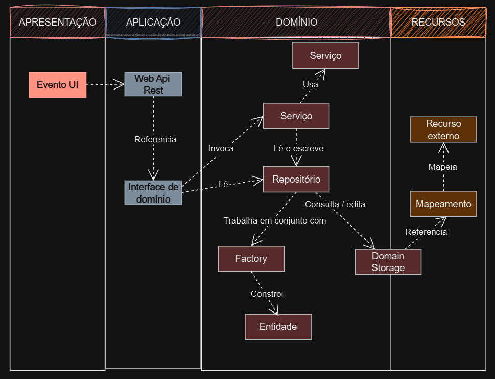

# Arquitetura Orientada a Domínio



A figura acima apresenta o domínio e outros andares da aplicação. Uma arquitetura baseada utilizando rest Api é apresentada na camada de aplicação pode ser imaginado como um controller como estamos acostumados, e a interface de domínio como uma interface ou classe abstrata  que se refere a um objeto inicializado no controller que pode ser um serviço de domínio ou uma interface de interação.

## Ações de Leitura

As ações de leitura são operações que apenas consultam o estado atual do sistema, sem realizar alterações. Elas se limitam a recuperar e exibir informações para o usuário, como listar itens em uma coleção ou gerar relatórios. Por exemplo, uma lista de produtos pode ser exibida para o usuário sem que o sistema altere qualquer dado:

```csharp
public IEnumerable<Product> GetProducts()
{
    return _productRepository.GetAll();
}
```

A preocupação central nas ações de leitura é a eficiência, como a minimização da criação de novos objetos e o aumento da velocidade de execução. O padrão Fastlane, por exemplo, pode ser útil para reduzir a carga no sistema ao otimizar a leitura dos dados diretamente do repositório. Nos sistemas orientados ao domínio, essas ações geralmente consultam um ou mais repositórios, os quais representam o estado do sistema através das entidades armazenadas.

## Ações de Edição

As ações de edição, diferentemente das de leitura, alteram o estado do sistema. Elas devem garantir consistência e integridade durante a alteração e, por isso, geralmente são realizadas em ambiente transacional. Antes de qualquer modificação, várias verificações são feitas para assegurar que todas as regras de negócio, ou "restrições", sejam satisfeitas. Em sistemas orientados ao domínio, as ações de edição trabalham diretamente com as entidades. Um exemplo de uma ação de edição em C# .NET poderia ser:

```csharp
public void UpdateProduct(int productId, string name, decimal price)
{
    var product = _productRepository.GetById(productId);
    if (product == null)
        throw new InvalidOperationException("Produto não encontrado");

    product.Name = name;
    product.Price = price;

    _productRepository.Save(product);
}
```

Aqui, o serviço atua como orquestrador, alterando os dados conforme as regras definidas, respeitando o Princípio da Responsabilidade Única. Se várias operações são necessárias para concluir uma edição, um "serviço coreógrafo" pode coordenar outras operações. Por exemplo, além de atualizar o produto, ele pode disparar um e-mail de notificação ao administrador.

## Integração entre camadas

A ação pode precisar criar uma representação intermediária das entidades para minimizar a dependência direta entre a camada de domínio e a camada de aplicação, uma técnica que reduz a complexidade de integração entre essas camadas. Em sistemas orientados ao domínio, objetos complexos que representam dados do domínio frequentemente são utilizados em várias camadas da aplicação. Por exemplo:

```csharp
public ProductDto GetProductForDisplay(int productId)
{
    var product = _productRepository.GetById(productId);
    return new ProductDto
    {
        Id = product.Id,
        Name = product.Name,
        Price = product.Price
    };
}
```
Neste caso, a entidade Product é convertida em um objeto ProductDto que é mais adequado para exibição. Para garantir a consistência, Montador transforma a entidade de domínio em uma estrutura própria para a camada que a consome, evitando modificações desnecessárias no domínio.

## O Repositório

O repositório atua como um gerenciador das entidades que compõem o estado do sistema, escondendo a complexidade do armazenamento de dados e provendo acesso às entidades onde quer que estejam, seja em banco de dados, arquivos XML ou outra fonte. Ele também é responsável por manter a consistência dos dados. Em um exemplo básico em C#:

```csharp
public class ProductRepository : IProductRepository
{
    private readonly DbContext _context;

    public ProductRepository(DbContext context)
    {
        _context = context;
    }

    public Product GetById(int id)
    {
        return _context.Products.Find(id);
    }

    public void Save(Product product)
    {
        _context.Products.Update(product);
        _context.SaveChanges();
    }
}
```

O repositório aqui oculta a lógica de acesso ao banco de dados, deixando que os serviços acessem as entidades sem se preocupar com os detalhes de persistência.

## Critérios de Pesquisa

Pesquisar informações dentro do sistema é uma tarefa central, especialmente em sistemas orientados ao domínio, onde encontrar entidades que atendam a determinados critérios é comum. Um critério de pesquisa pode ser um objeto que define as condições de busca, permitindo maior flexibilidade e encapsulamento da lógica de pesquisa. Em C#, um padrão comum para isso é o uso de Specification ou QueryObject:

```csharp
public class ProductSearchCriteria
{
    public decimal? MinPrice { get; set; }
    public decimal? MaxPrice { get; set; }
    public string Name { get; set; }
}
```

Este ProductSearchCriteria encapsula os filtros de busca. O repositório pode então usar um método que recebe esse critério e faz a pesquisa:

```csharp
public IEnumerable<Product> Search(ProductSearchCriteria criteria)
{
    var query = _context.Products.AsQueryable();

    if (criteria.MinPrice.HasValue)
        query = query.Where(p => p.Price >= criteria.MinPrice.Value);
    if (criteria.MaxPrice.HasValue)
        query = query.Where(p => p.Price <= criteria.MaxPrice.Value);
    if (!string.IsNullOrEmpty(criteria.Name))
        query = query.Where(p => p.Name.Contains(criteria.Name));

    return query.ToList();
}
```

Esse uso de critérios evita que a camada de aplicação precise conhecer os detalhes de consulta, respeitando a separação de responsabilidades.

Essas práticas, exemplificadas em C# e .NET, refletem uma abordagem orientada ao domínio, onde as ações de leitura e edição interagem de forma bem definida com repositórios e serviços. Cada camada possui responsabilidade clara, favorecendo a manutenção e escalabilidade do sistema.