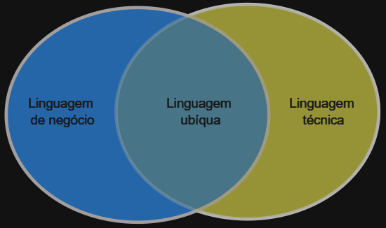

# DDD

O que é DDD?

Segundo Eric Evans, criador do DDD, ele o definiu assim:

>*`DDD é uma abordagem para desenvolvimento de sistemas de software complexos, em que: (1) o foco está no domínio do sistema; (2) desenvolvedores e especialistas no negócio devem explorar esse domínio de forma colaborativa; (3) como resultado, eles devem se comunicar usando uma linguagem ubíqua, mas dentro de um contexto delimitado.`*

E como quase tudo na internet, existem muitos `"especialistas"` no assunto que o definem de muitas formas diferentes.
O que aparentemente todos concordam é o que DDD não é.

## DDD Não é

- Sobre como organizar seu projeto
- Regra sobre definição de pastas de um projeto
- Uma arquitetura em camadas
- Um padrão de arquitetura de implementação somente

## Minha definição sobre DDD.

É sim sobre arquitetura de software, porém atua em uma camada conceitual. Há quem diga que é um conjunto de princípios, e que não é arquitetura, respeitosamente discordo. Dado que o DDD se divide em Estratégico e Tático, o tático por muitas vezes informa como deve ser implementado algo, embora independente de tecnologia.

## Design Estratégico

O design estratégico agrupa um conjunto de princípios e padrões, que divide um problema complexo de negócio em vários pedaços com limites claros e responsabilidades específicas, construindo desta forma uma topologia de design de software de alto nível.
O design estratégico tem como principal objetivo definir os Bounded Contexts (Contextos delimitados), a Linguagem Ubíqua (linguagem comum) e os Context Maps (Mapa de contextos de negócio). Tudo com a colaboração de toda a equipe do projeto, composto pela equipe técnica e os especialistas do domínio ou Domain Expert (Especialista de negócio).

### Domain Expert

Para desenvolver um bom software com vida longa, precisamos não apenas conhecer, mas entender sobre as regras de negócio que fazem parte daquele fluxo que será transformado em software. Então DDD define que exista o `Domain Expert`, que nada mais é do que a pessoa responsável por conhecer o negócio. Pode ser o PO do Scrum, Analista de Negócio ou como quiserem chamar, não existe um conflito aqui entre o papel na metodologia de desenvolvimento e o papel necessário para atender o DDD.

### Linguagem Ubíqua

Normalmente temos um cenário que divide o pessoal de negócio do pessoal técnico.
Então as pessoas desenvolvedoras, que precisam transformar a necessidade do negócio em objetos e os relacionamentos entre eles, aplicando abstração, herança, polimorfismo, patterns, frameworks, entre outros.
Por outro lado os Domains Experts, conhecem a fundo o negócio e suas terminologias especificas, desconhecendo as terminologias técnicas.

Este cenário indica que pessoas que entendem do negócio não sabem transformar os fluxos em código funcionando, por outro lado é muito comum que pessoas técnicas não entendam as regras de negócio, o que eventualmente gera bugs relacionados e negócio.

A intenção da linguagem ubíqua é eliminar este atrito entre as equipes, fazendo que todos da equipe chamem a mesma coisa relacionada a negócio com o mesmo nome.

### Bounded Context (Contexto delimitado)

Quando estamos construindo grandes soluções, pode ocorrer de termos um domínio muito grande e a modelagem acaba por ficar complexa demais para se ter um único modelo unificado. Tendo em mente que cada área de negocio terá seu vocabulário (linguagem ubíqua) diferente dado o contexto do seu dia a dia isso se torna um problema ainda maior.

Então para resolver este problema temos a ferramenta de contexto delimitado, que tem o objetivo de nos apoiar com grandes modelos de domínio, estabelecendo limites e tornando-os menores e mais fácil de trabalhar, criando relacionamentos entre eles de forma explicita.

Cada limite conceitual tem seus termos com significado específico que reflete sua linguagem, direcionando o time a entender melhor o negócio e e definindo onde inicia e onde termina a responsabilidade de cara parte do sistema. Importante limite que divide cada contexto deve ser claro para todos, para além de cada contexto ter usa própria linguagem, o mesmo deve valer para arquitetura de software.

### Context Map 

Mapa de contexto representa a visão holística do software, um documento pragmático que tem a finalidade de facilitar o entendimento dos contextos. Não deve, inicialmente, ser um documento complexo com uso de ferramentas avançadas, o importante é ele refletir o estado atual do projeto. Um diagrama simples que represente o estado presente, não o futuro do software como um todo, pois precisamos inicialmente ter a compreensão correta de onde estamos.

Não se tratando de um documento oficial, com alto nível de informalidade, ele não se trata de um diagrama de arquitetura, mas sim um mapa para termos a compreensão das relações entre os contextos delimitados de negócio da corporação. Este documento esta, assim como a linguagem ubíqua, em um espaço entre o negócio e o técnico. Uma vez o mapa desenhado, ele deve ajudar a equipe a ter a compreensão do domínio de negócio, como as integrações devem ser seguidas. Com o projeto avançando, este diagrama deve ser atualizado para refletir cada novo cenário proposto no projeto.

## Design Tático

O design tático avança no sentido de implementação, não define tecnologia, mas agrupa um conjunto de ferramentas que devem ser utilizados na construção do modelo de domínio, aplicados a um único contexto delimitado - que foi definido no design estratégico.

Podemos dividir inicialmente este grupo de ferramentas assim:

> ### Camada de domínio
>
> - Models
>   - Entidades
>   - Agregados / Agregações
>   - Fábricas
>   - Objetos de valor
> - Services
>   - Repositórios
>   - Serviços externos
>   - Serviços de comportamento entre agregados

### Modelo de domínio

O modelo de domínio é a estruturação do problema a ser resolvido com software, representando o vocabulário e conjunto de conceitos do domínio. Identifica os relacionamentos entre entidades e atua como ferramenta de comunicação.
Precisa representar o modelo de negócio a ser resolvido. (Puro suco de orientação a objetos)

`Entidades`: diferente do modelo anêmico onde as entidades normalmente representam tabelas no banco de dados, em DDD uma entidade representa um problema a ser resolvido, algo que existe no mundo real e que será resolvido com código.

> Vamos tentar exemplificar, fazer um de para de um CRUD com DDD.
>
>Pensando em uma regra de aumento de salário, em um CRUD você informa o valor e, ou precisa identificar todas as regras em tela para resolver isso, passando a responsabilidade de resolver problema para o usuário. Ou seja, você não esta de fato automatizando o processo, mas sim adicionando uma camada a mais no processo.
>
>No mundo real você não tem um alterar salário, você tem um motivo com muitas regras para resolver como e quanto será este aumento.
Então o especialista de domínio deve informar as regras da empresa quanto a quinquênio, quadriênio, inflação, dissidio, etc, para que todas as regras sejam adicionadas em código.
>
>Então você passa a ter algo mais próximo do mundo real, na tela do CRUD, agora você tem motivos para aumentar este salário, que podem ser dissidio, completar 4 ou 5 anos de empresa, espontâneo e qualquer outra regra que possa existir.

`Agregados / Agregações`: Uma agregação é o conjunto de classes e objetos de valor que só fazem sentido em conjunto. Vamos detalhar um pouco mais, pensaremos em uma estrutura de cliente, este cliente tem um endereço para cobrança e só, para simplificar. Logo temos uma agregação onde o Cliente é a raiz e o endereço é um agregado. Uma raiz de agregação significa que toda alteração do conjunto de classes que fazem parte deste agregado são de responsabilidade da raiz, a raiz age como uma especie de abstração da agregação, onde você solicita para raiz altear o endereço, mas desconhece a implementação do como isso ocorre.

`Fábricas`: Fábricas em DDD não é necessariamente a implementação do Abstract Factory, mas sim a ferramenta que garante que todo e qualquer objeto foi construído mantém um estado válido.
Então em DDD temos pelo menos duas formas de fabricar objetos, uma delas é o próprio construtor, onde não existe dependência para fora do da agregação.
Por exemplo, para construir um cliente eu preciso de um cpf válido e de que exista um endereço.
Agora, quando existe dependência de outro agregado eu preciso ter um serviço de construção, que é outra forma de fabricar o objeto.
Por exemplo, para criar um cliente eu preciso garantir que ele não existe e não tem débitos, então na fábrica eu tenho uma interface que recebe um serviço que consulta na outra agregação, via repositório, se aquela pessoa possui dívidas.

`Objetos de Valor`: Um objeto de valor nada mais é um objeto que não atualiza estado, ou seja, qualquer alteração neste objeto, na verdade é a criação de outro objeto. Na maioria das implementações de endereço, exceto correios talvez, o endereço tende a ser um objeto de valor, ou seja, você o atualiza como um todo.

Vamos pensar no cenário mais contraditório a esta regra, alguém que mora em um apartamento em um prédio que esta em uma rua, em um bairro, etc, etc.
Esta pessoa se muda do apartamento 401 para o 402 que fica exatamente em frente. Então, neste caso podemos apenas alterar o número correto?
Vamos pensar orientados a objeto, que é a tradução do mundo real par código. Quando você se muda desta forma, a disposição de tudo muda, a posição do sol, ou seja, não foi apenas o número. Então, sempre que tivermos alteração em endereço, o que ocorre não é um update, mas sim a exclusão de um endereço antigo para criação de um novo endereço, e isso deve refletir nas regras de negócio que definem o contexto delimitado.

### Serviços de domínio 

Serviços de domínio são estruturas sem estado que fornecem o comportamento do mundo real descrito nas regras de negócio, normalmente um serviço de domínio pode atuar como um orquestrador de fluxo entre diversas entidades e agregações. Por representarem negócio, não devem ter contato com os detalhes técnicos de implementação.
Em resumo, um serviço deve ser utilizado sempre que uma entidade não for suficiente para resolver o problema de negócio.
Como o modelo de domínio geralmente lida com os conceitos mais profundos e específicos das regras de negócio um serviço de domínio tender a resolver problemas que são complexos demais para uma entidade ou agregação resolver sozinha.

> Nota: O Serviço de Domínio não tem nenhuma relação com os Serviços de outras camadas, exceto o nome.

`Repositórios`: Repositórios podem ser um design patterns para banco de dados, mas eu prefiro trocar banco por origem, dado que para o domínio não importa a tecnologia de armazenamento.
Uma vez que definimos que repositório representam uma origem de dados, vamos tentar definir as funções.
Um repositório deve resolver os problemas de relacionamento com dados de uma agregação, logo, por esta definição precisamos entender que só deve existir um repositório por agregação, que toda entrada de dados deve ser através da raiz de agregação.

Ou seja, no exemplo de cliente com endereço de cobrança, qualquer alteração de endereço deve ser tratada a partir da raiz, que é cliente. O método de update do repositório que deve identificar e tratar que o endereço foi alterado.

No repositório também podemos ter os métodos de CRUD alinhados com negócio.

`Serviços externos` e `Serviços de comportamento entre agregados`: São os serviços que resolvem problemas que a entidade ou agregação sozinha não consegue resolver, assim como no exemplo acima de Fabrica, que é um serviço de comportamento entre agregados simples do exemplo de cliente com endereço de cobrança.

## Camada anticorrupção

Como bonus, não esta necessariamente definido nas regras do DDD de forma explicita, mas devido ao grande uso de microsserviços na atualizada a camada anticorrupção tem ficado mais evidente.

Ha quem defenda que uma agregação do DDD em uma estrutura monolítica tende a se transformar em um microsserviço, o que concordo, mas adiciono sempre que possível. Então a camada anticorrupção é um mecanismo de proteção do domínio contra conceitos externos ao seu contexto, garantindo que o design deste microsserviço da aplicação não seja corrompido por dependências externas a ele, reduzindo o acoplamento e fazendo com que o sistema possa evoluir de forma independente.

Resumindo, a cama anticorrupção é um adaptador que intermediá a comunicação entre os serviços garantindo que apenas trocas de dados válidas ocorram entre os dois sistemas impedindo que um dependa do design do outro para existir e funcionar.

## Conclusão

Primeiramente DDD não é só isso, o que esta passado acima é um resumo muito pequeno de tudo que é o DDD, mas é relevante entendermos que o DDD não é sobre código ou arquitetura `apenas`, ele torna a equipe mais colaborativa, obriga que o conhecimento de negócio seja aprendido gradativamente por toda equipe diminuindo a dificuldade para implementação das soluções de problemas complexos.
Tornar a interação e integração entre o time de negócio e o time técnico através da comunicação efetiva é uma das vantagens do DDD.
Porém como qualquer arquitetura, metodologia ágil, frameworks, biblioteca ou ferramentas, tem vantagens e desvantagens, onde requerem um conjunto de pré-requisitos para atender.

Eu entendo que, como vai para além do código, por mais que exista uma dificuldade grande na aprendizagem do DDD, por mais que toda a equipe seja especialista, se não existir a vontade da instituição, DDD tende a fracassar.