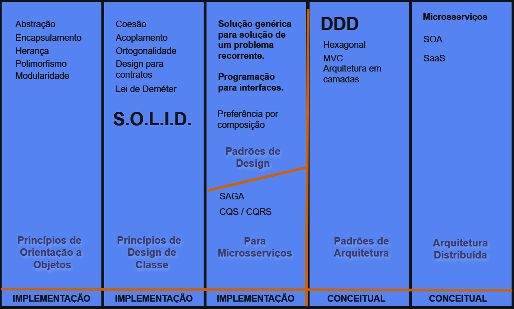

# Então isso é tudo?

Bom, lamento informar que é só o começo.

Gosto de utilizar esta imagem como trilha de conhecimento, no sentido de guia e hierarquia.
Não tem tudo que se precisa saber nesta trilha, mas como a ideia é ser um guia podemos inferir que sem os conhecimentos de base de orientação a objetos, não teremos capacidade para entendimento claro de design de classe, assim como se não entendermos os princípios de design de classes, não teremos capacidade de entender padrões de design, e de forma mais ampla, se não tivermos conhecimento dos princípios para implementação, não teremos capacidade de entendimento dos princípios conceituais.

